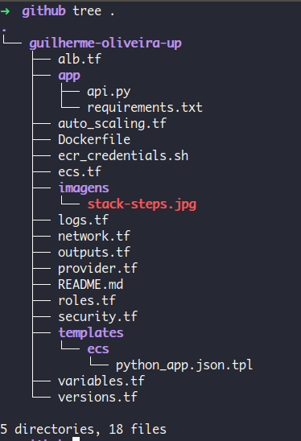
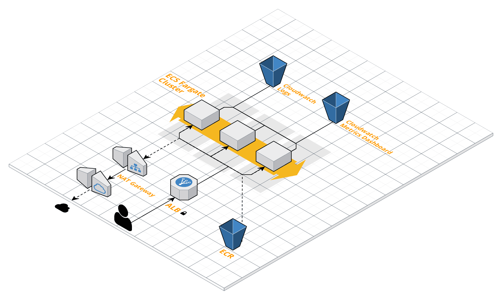

# Apresentação
[](https://travis-ci.com/guilhermerenew/stack-fargate)
> A escolha de tecnologias é livre para a resolução do problema. Utilize os componentes e serviços que melhor domina pois a apresentação na entrega do desafio deverá ser como uma aula em que você explica em detalhes cada decisão que tomou.

## Sobre
Projeto se baseia em execução de API REST em python para realização de chamadas e valores mantidos podem ser consultados por consultas HTTP. Vimos essa aplicação de um modo não só interativo mais que pode ser utilizado em diversas frentes com relação a comunicação e status page. Por se basear em chamadas REST e a uma liguagem de facil execução e interpretação o mapeammento da evolução de plataforma foi divido entre as etapas:


Com essas etapas simples, foi construída uma stack de entrega de infraestrutura baseada em diversos pontos com relação a qualidade de software, disponibilidade e resproveitamento de código. Vamos passar por cada uma delas.

## App.
Como descrito abaixo o método de consulta com relação a aplicação é basicamente o POST de um novo comentário e a consulta do mesmo. Porém isso não inibe a forma como código estará disponibilizado e para nós voltados a Infra, termos escalabilidade e precisão a cada passo que a aplicação realiza.

## Build Image.
Pensando em emcapsular uma aplicação de forma integra e mantendo os componentes intactos o docker foi a solução mais rápida e simples de disponibilizarmos a aplicação aonde quer que ela esteja. Isso quer dizer que em qualquer com disponibilidade de execução de containers esta imagem será executada da mesma forma.

## Dockerfile.
```dockerfile 
#Base Image from Python Alpine ~95.1MB
FROM python:3.6.4-alpine3.7

#Environment Mapping
WORKDIR /app
ADD     ./app /app
COPY    ./app/requirements.txt /etc

#Deployment App!
RUN     pip install -r /etc/requirements.txt
EXPOSE  8000:8000
CMD     ["gunicorn" , "-b", "0.0.0.0:8000", "--log-level", "debug", "api:app"]
```
Dockerfile é a base inicial para criação e postagem de imagem com aplicação, parametros de inicialização "CMD" são passados diretamente em imagem, automatizando sua inicialização :) 

## Playground Development.
Tal etapa é onde desenvolvemos **e testamos** toda entrega da infraestrutura e como ela será disponibilizada posteriormente. Tal etapa envolve a entrega da infra como código e pipeline de teste automatico do mesmo.

## Push image.
A definição de como e onde seria feito o armazenamento de imagem criada foi pensada em menos etapas de postagens e ferramentas se integrem facil e se possivel centraliza-las. Pensando nisso, o processo de push é feito para Cloud Privada na AWS, sendo que em etapa seguinte a consulta entre repositório e aplicação é mais rapida por estarem em mesma provider.

Funções dentro de .travis.yml realizam a criação de repositório privado, a tag de imagem e o push para Registry:
```yaml
---
- aws ecr create-repository --repository-name guilhermerenew/python-app --image-tag-mutability IMMUTABLE --region us-west-2
- aws ecr get-login-password --region us-west-2 | docker login --username AWS --password-stdin 417311404467.dkr.ecr.us-west-2.amazonaws.com
- docker build -t guilhermerenew/python-app .
- docker tag guilhermerenew/python-app:latest 417311404467.dkr.ecr.us-west-2.amazonaws.com/guilhermerenew/python-app:latest
- docker push 417311404467.dkr.ecr.us-west-2.amazonaws.com/guilhermerenew/python-app:latest
```

## Running Application
O Provisionamento de toda a Infraestrutura foi pensada em disponibilidade e escalabilidade que aplicação pode sofrer. Tento em consideração diversos métodos de provisionamento foi escolhido o Terraform por questão de ser multi-cloud, atender mais de 90% dos recursos AWS e GCP e pela maturidade que **time todo** alcança com a implantação por tal linguagem.

## Arquivos .tf trazem cada um uma função, ou recurso dentro do provider escolhido:


## Diagrama de Aplicação AWS:ECS


alb.tf              - Definição de LoadBalancer e Target Group. \
autoscaling.tf     - Auto Escalonamento de containers ECS \
ecs.tf              - Definições de container \
logs.tf             - Métricas CloudWatch! \
network.tf          - Definições de subnet priv/pub \
outputs.tf          - Assim que finalizamos o nosso deployment é retornado o DNS publico para acesso! \
provider.tf         - Qual Provider iremos provisionar os recursos descritos \
roles.tf            - Politicas de IAM \
security.tf         - Security Groups que definimos ter acesso a aplicação \
versions.tf         - variavel de versão do terraform \
variables.tf        - Definições de variaveis Globais

## TravisCI
Desde etapa de build a execução dos arquivos terraform cada uma dessas etapas são descritas em arquivos .travis em diretório raiz do repositório. TravisCi funciona definindo as etapas que deseja que executar a cada PR que é realizado, ou seja assim que um novo PR for aberto TravisCI entendi tal situação e inicia as tarefas definidas.

### Exemplo de um PR que foi validado por TravisCI antes de ser realizado o Merge: [Aqui](https://github.com/guilhermerenew/guilherme-oliveira-up/commit/a623a881b24082a604ae5ec8051846fc842e3e38)

## Merges Orientados a Validações! 
Quando utilizamos o TravisCI e passamos as suas condiçoes dentro do arquivo yml ele se auto valida e realiza as tarefas que lhe foram passadas, caso alguma função durante o teste quebre, automaticamente seu teste sera cancelado e poderá ter uma validação dos erros antes de realizar o Merge.

Com isso temos uma segurança e liberdade bem mais com relação a testes e novas funcionalidades! 

# Descrição do Case 
## Considerações Gerais

Você deverá usar este repositório como o repo principal do projeto, i.e., todos os seus commits devem estar registrados aqui, pois queremos ver como você trabalha.

A escolha de tecnologias é livre para a resolução do problema. Utilize os componentes e serviços que melhor domina pois a apresentação na entrega do desafio deverá ser como uma aula em que você explica em detalhes cada decisão que tomou.

Registre tudo: testes que foram executados, ideias que gostaria de implementar se tivesse tempo (explique como você as resolveria, se houvesse tempo), decisões que foram tomadas e seus porquês, arquiteturas que foram testadas e os motivos de terem sido modificadas ou abandonadas. Crie um arquivo COMMENTS.md ou HISTORY.md no repositório para registrar essas reflexões e decisões.


# O Problema

O desafio que você deve resolver é a implantação da aplicação de Comentários em versão API (backend) usando ferramentas open source da sua preferência.

Você precisa criar o ambiente de execução desta API com o maior número de passos automatizados possível, inclusive a esteira de deploy.

A aplicação será uma API REST que está disponível neste repositório. Através dela os internautas enviam comentários em texto de uma máteria e acompanham o que outras pessoas estão falando sobre o assunto em destaque. O funcionamento básico da API consiste em uma rota para inserção dos comentários e uma rota para listagem.

Os comandos de interação com a API são os seguintes:

* Start da app

```
cd app
gunicorn --log-level debug api:app
```

* Criando e listando comentários por matéria

```
# matéria 1
curl -sv localhost:8000/api/comment/new -X POST -H 'Content-Type: application/json' -d '{"email":"alice@example.com","comment":"first post!","content_id":1}'
curl -sv localhost:8000/api/comment/new -X POST -H 'Content-Type: application/json' -d '{"email":"alice@example.com","comment":"ok, now I am gonna say something more useful","content_id":1}'
curl -sv localhost:8000/api/comment/new -X POST -H 'Content-Type: application/json' -d '{"email":"bob@example.com","comment":"I agree","content_id":1}'

# matéria 2
curl -sv localhost:8000/api/comment/new -X POST -H 'Content-Type: application/json' -d '{"email":"bob@example.com","comment":"I guess this is a good thing","content_id":2}'
curl -sv localhost:8000/api/comment/new -X POST -H 'Content-Type: application/json' -d '{"email":"charlie@example.com","comment":"Indeed, dear Bob, I believe so as well","content_id":2}'
curl -sv localhost:8000/api/comment/new -X POST -H 'Content-Type: application/json' -d '{"email":"eve@example.com","comment":"Nah, you both are wrong","content_id":2}'

# listagem matéria 1
curl -sv localhost:8000/api/comment/list/1

# listagem matéria 2
curl -sv localhost:8000/api/comment/list/2
```


# O que foi levado em conta! 

- [x] Automação da infra, provisionamento dos hosts (IaaS)
- [x] Automação de setup e configuração dos hosts (IaC)
- [x] Pipeline de deploy automatizado
- [x] Monitoramento dos serviços e métricas da aplicação
